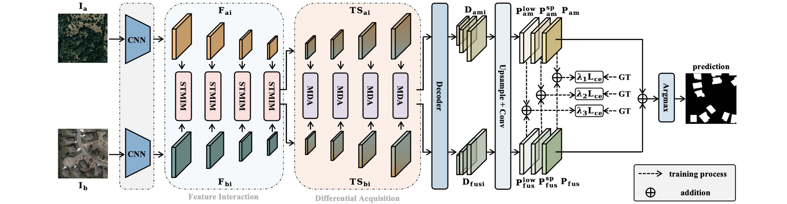

<div align="center">
<h1 align="center">STMINet</h1>

<h3>STMINet: Spatio-Temporal Multigranularity
Intermingling Network for Remote
Sensing Change Detection</h3>

[Yuan Wang]()<sup>1</sup>, [Sixian Chan](https://scholar.google.com.hk/citations?user=2xsZC9wAAAAJ&hl=zh-CN&oi=ao)<sup>1 *</sup>, [Yanjing Lei](https://chengxihan.github.io/)<sup>1</sup>, [Wangjie Zhou]()<sup>1</sup>, [Jie Hu]()<sup>2</sup>, [Xiaolong Zhou]()<sup>3</sup>, [Tianyang Dong]()<sup>1</sup>

<sup>1</sup> Zhejiang University of Technology, <sup>2</sup> Wenzhou University,  <sup>3</sup> Quzhou University.

<sup>*</sup> Corresponding author


[](https://ieeexplore.ieee.org/abstract/document/11153030)  

[**Overview**](#overview) | [**Get Started**](#%EF%B8%8Flets-get-started)

</div>

## 🛎️Updates

* **` Sept. 25th, 2025`**: The code for STMINet have been uploaded. You are welcome to use them!!
* **` Sept. 4th, 2025`**: STMINet has been accepted by IEEE JSTARS！We'd appreciate it if you could give this repo a ⭐️**star**⭐️ and stay tuned!!


## 🔭Overview

<p align="center">
  
</p>


## 🗝️Let's Get Started!
### `A. Installation`

**Step 1: Clone the repository:**

Clone this repository and navigate to the project directory:
```bash
git clone https://github.com/heikeyuhuajia/STMINet
cd STMINet
```


**Step 2: Environment Setup:**

***Create and activate a new conda environment***

```bash
conda create -n stminet
conda activate stminet
```

***Install dependencies***
This code has been tested on a workstation equipped with Intel Xeon Gold 6133 CPU and an NVIDIA RTX A6000 GPU (with 48GB of video memory), using Python 3.8.19, PyTorch 2.0, and CUDA 11.8.

### `B. Data Preparation`
* LEVIR-CD:
[LEVIR-CD](https://justchenhao.github.io/LEVIR/)
* WHU-CD:
[WHU-CD](https://study.rsgis.whu.edu.cn/pages/download/building_dataset.html)
* GZ-CD:
[GZ-CD](https://github.com/daifeng2016/Change-Detection-Dataset-for-High-Resolution-Satellite-Imagery)
* SYSU-CD:
[SYSU-CD](https://github.com/liumency/SYSU-CD)

and put them into data directory.


### `C. Training`

```bash
python c1_train_STMINet.py
```
## `D. Test`

```bash
python eval_STMINet.py
```


## 📜Reference

If this code contributes to your research, please kindly consider citing our paper and give this repo ⭐️ :)
```
@ARTICLE{11153030,
  author={Wang, Yuan and Chan, Sixian and Lei, Yanjing and Zhou, Wangjie and Hu, Jie and Zhou, Xiaolong and Dong, Tianyang},
  journal={IEEE Journal of Selected Topics in Applied Earth Observations and Remote Sensing}, 
  title={STMINet: Spatio-Temporal Multigranularity Intermingling Network for Remote Sensing Change Detection}, 
  year={2025},
  volume={18},
  number={},
  pages={23458-23473},
  keywords={Feature extraction;Transformers;Semantics;Shape;Convolutional neural networks;Accuracy;Remote sensing;Interference;Graph neural networks;Visualization;Multibranch differential acquisition (MDA);remote sensing change detection (RSCD);spatio-temporal multigranularity intermingling module (STMINet)},
  doi={10.1109/JSTARS.2025.3607201}}
```


## 🤝Acknowledgments
This project is based on SEIFNet ([paper](https://ieeexplore.ieee.org/abstract/document/10419228)), DMINet ([paper](https://ieeexplore.ieee.org/document/10034787)), VcT ([paper](https://ieeexplore.ieee.org/abstract/document/10294300)). Thanks for their excellent works!!

